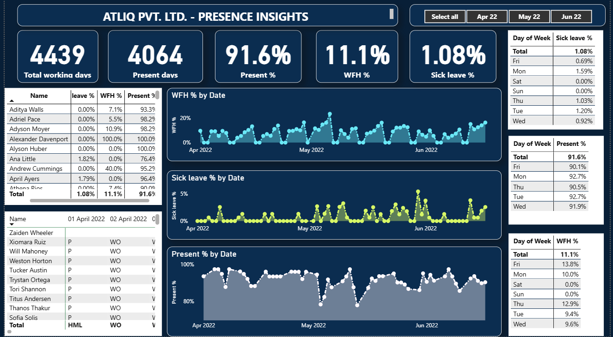

# HR Presence Insights Dashboard

## 📊 Project Overview

This project is an **HR Analytics Dashboard** built using **Excel** and **Power BI** to analyze employee presence data. The dashboard provides insights into attendance patterns, work-from-home (WFH) trends, and leave percentages across different time periods and days of the week.

The dataset contains employee-level attendance records, and the dashboard transforms this raw data into meaningful business insights for HR teams and management.

---

## 🗂 Dataset

* **File Name**: `Attendance Sheet 2022-2023_Masked.xlsx`
* **Key Columns**:

  * Employee Name
  * Date
  * Attendance Status (Present, WFH, Leave, Week Off, Holiday)
* **Period Covered**: April 2022 – June 2022

---

## 📌 Key Metrics

* **Total Working Days**: 4,439
* **Present Days**: 4,064
* **Presence %**: 91.6%
* **WFH %**: 11.1%
* **Sick Leave %**: 1.08%

---

## 📈 Dashboard Features

The Power BI dashboard provides the following insights:

1. **KPIs**

   * Total Working Days
   * Present Days
   * Presence %
   * WFH %
   * Sick Leave %

2. **Trend Analysis**

   * WFH % by Date
   * Sick Leave % by Date
   * Presence % by Date

3. **Day-wise Insights**

   * Day of Week vs Sick Leave %
   * Day of Week vs Presence %
   * Day of Week vs WFH %

4. **Employee-wise Performance**

   * Presence %, Leave %, and WFH % per employee
   * Daily attendance records

---

## 📷 Dashboard Preview

---

## 🚀 Tools & Technologies Used

* **Excel** → Data Cleaning & Preprocessing
* **Power BI** → Data Visualization and Insights

---

## 📚 Key Learnings

* Building KPIs for HR metrics
* Designing interactive dashboards with filters (month & employee)
* Trend analysis for attendance & leave patterns
* Using DAX measures for calculating percentages

Would you like me to also **add GitHub formatting for dataset + PBIX + screenshot links** (so the README looks clickable and professional in your repo)?
